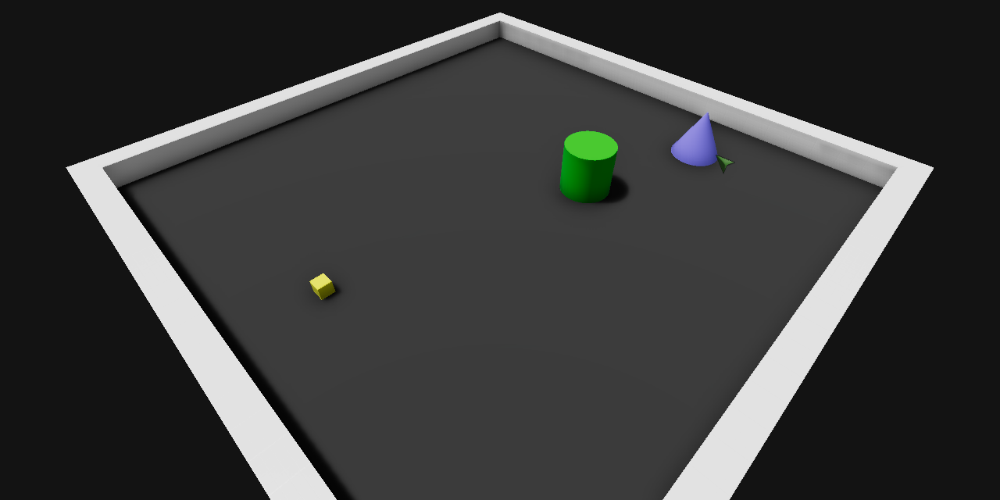

# Minimal Action RPG Template for O3DE



This template provides a starting point to create an **Action Role-Playing Game (ARPG)** in [O3DE (Open 3D Engine)](https://www.o3de.org) using the supported scripting languages (i.e. **Lua**, **ScriptCanvas**).

It includes the core mechanic for a real-time combat using the mouse. The enemy moves throught a series of predefined waypoints, and can react only when he is attacked by the player. When the enemy is defeated, he drops a potion that the player can use to restore his health.

This template is part of a wider collection that covers several game genres. Please refer to the [parent repository](https://github.com/matteogrs/templates.o3de.minimal) for the full list of available templates and more details about the design philosophy behind them.

## Install
1. Install [O3DE (Open 3D Engine)](https://www.o3de.org) following the steps that are described in [Get Started](https://www.o3de.org/docs/welcome-guide/setup/) page of the official documentation.

	> The engine version must support `Script-only` mode (2409.1 or greater).

2. Launch `Project Manager`, as it is described in the [dedicated section](https://www.o3de.org/docs/welcome-guide/create/creating-projects-using-project-manager/#launch-project-manager) of the official documentation.
3. Choose `Engine` tab, and then select `Remote Sources` subsection.
4. Press `Add Repository` button and paste the address of this repository:
```
https://github.com/matteogrs/templates.o3de.minimal.action-rpg/raw/refs/tags/v1.0.0-beta.1
```
5. Return to `Projects` tab, and press `New Project...` button. Confirm the action by selecting `Create New Project` option in the dropdown menu.
6. Scroll down to `Select a Project Template` section, and select the variant of **Minimal Action RPG** in your preferred scripting language. The small cloud icon that is visible in its top-right corner suggests that the template files still need to be downloaded from the remote repository.
7. In the right panel, press `Download Template` button and wait for its completion.
8. Fill out the remaining fields as you wish, and press `Create Project` to continue.
9. In the main page, press `Build Project` button on the icon of the new created project.

	> No C++ compiler is needed at this stage. Only the required runtime files are copied from the engine directory to the project one.

10. The project is now ready. You can start playing it by pressing `Open Editor` button.

## Controls
| Keys | Description |
| :---: | :--- |
| <kbd>Left button (Mouse)</kbd> | Move toward point |
| <kbd>Right button (Mouse)</kbd> | Attack in that direction |

## Next steps
*Coming soon! Please check again [this repository](https://github.com/matteogrs/templates.o3de.minimal.action-rpg) for new updates about this section.*

## Contribute
This project is intended as an educational tool for getting started with the game development, so some limitations are applied to contributions in order to preserve its main purpose:
- bugs, crashes or any other technical error can be reported in our [issues tracker](https://github.com/matteogrs/templates.o3de.minimal.action-rpg/issues). Bear in mind that some flaws may exist *"by design"* for learning purposes;
- new features must be related to the core mechanics of this game genre. Their implementations must be simple and straightforward, and cover all the supported scripting languages;
- refactoring, breaking changes, or any other change to the project architecture aren't accepted at the moment.

Please refer to our [contribution guidelines](./CONTRIBUTING.md) for further details. In any case, please open an issue before submitting any pull request (PR) to this repository, in order to discuss its scope with maintainers.

## License
**Minimal Action RPG Template for O3DE** was created by [@matteogrs](https://github.com/matteogrs) and is licensed under the **Apache License, version 2.0**. Please see [LICENSE](./LICENSE) and [NOTICE](./NOTICE) files for further details and attributions.
